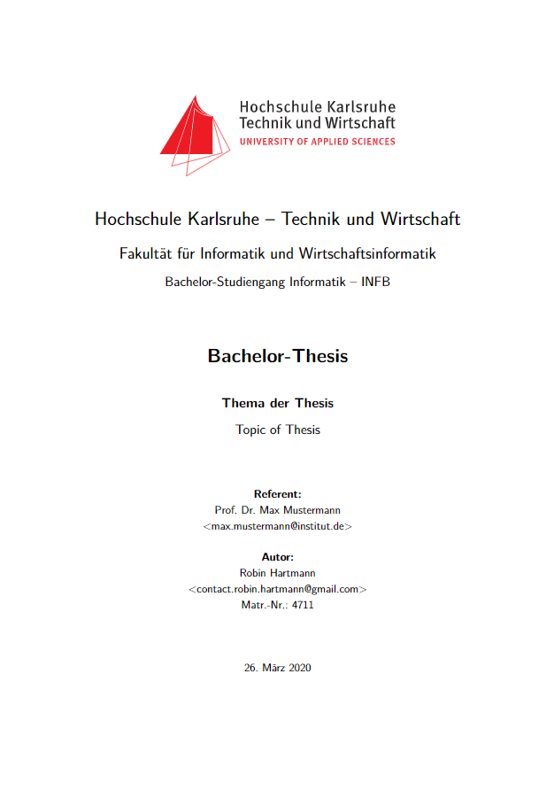

# 📄 template-paper-latex

Vorlage zum Erstellen von wissenschaftlichen Ausarbeitungen mit LaTeX

## ⭐ Features

- LaTeX-Vorlage
  - Hilfsbefehle
  - Layout
  - Code-Highlighting
  - Deckblatt
  - Inhalt
  - Verzeichnisse
  - Literaturangaben
  - Anhang
- Integration mit Visual Studio Code
  - Einstellungen
    - Automatisches Formatieren
    - Automatischer Build bei Änderungen
  - Erweiterungen

## 💡 [Beispiel](../../releases/latest)

## 🛠️ Verwendung

Folgen Sie diesen Anweisungen, um dieses Projekt auf Ihrem lokalen Rechner einzurichten und es zu verwenden.

### 📋 Voraussetzungen

- [MiKTeX](https://miktex.org/howto/install-miktex)
  - Diese Anleitung geht davon aus, dass Sie MiKTeX verwenden, aber Sie können auch eine andere LaTeX Distribution wählen
- [ActivePerl](https://www.activestate.com/products/perl/downloads/)
  - Diese Anleitung geht davon aus, dass Sie ActivePerl verwenden, aber Sie können auch eine andere Perl Distribution wählen
  - Stellen Sie sicher, dass der Installer den Ordner mit den Executables zum `PATH` hinzufügt
- [Visual Studio Code](https://code.visualstudio.com/) mit der Erweiterung [LaTeX Workshop](https://marketplace.visualstudio.com/items?itemName=James-Yu.latex-workshop)

### 🚀 Schnellstart

| Pfad                  | Inhalt                       | Anmerkung                                                                                                                 |
| --------------------- | ---------------------------- | ------------------------------------------------------------------------------------------------------------------------- |
| `src/`                | Quellcode des Dokuments      |                                                                                                                           |
| - `base/`             | Grundlegende Konfigurationen |                                                                                                                           |
| -- `styles/`          | Styles bzw. Layouts          |                                                                                                                           |
| --- `listing.tex`     | Style von Listings           | Hier wird Code-Highlighting konfiguriert.                                                                                 |
| --- `natdin.bst`      | Style von Literaturangaben   |                                                                                                                           |
| --- `page.tex`        | Style von Seiten             |                                                                                                                           |
| --- `title.tex`       | Style des Deckblatts         |                                                                                                                           |
| -- `commands.tex`     | Hilfsbefehle                 | Hier können die verfügbaren Befehle nachgeschlagen werden.                                                                |
| -- `packages.tex`     | Verwendete Packages          |                                                                                                                           |
| - `content/`          | Inhalte der Ausarbeitung     | Hier werden die Inhalte der einzelnen Kapitel abgelegt.                                                                   |
| - `content-appendix/` | Inhalte für den Anhang       | Hier werden die Inhalte des Anhangs abgelegt.                                                                             |
| - `images/`           | Bilder                       | Hier werden alle Bilder abgelegt.                                                                                         |
| - `listings/`         | Quellcode                    | Hier wird jeglicher Quellcode abgelegt.                                                                                   |
| - `tables/`           | Tabellen                     | Hier werden alle Tabellen abgelegt.                                                                                       |
| - `acronyms.tex`      | Abkürzungen                  | Hier werden Abkürzungen festgelegt.                                                                                       |
| - `appendix.tex`      | Anhang                       | Hier wird der Inhalt des Anhangs festgelegt.                                                                              |
| - `bibliography.bib`  | Literaturangaben             | Hier wird die verwendete Literatur angegeben.                                                                             |
| - `content.tex`       | Ausarbeitung                 | Hier wird der Inhalt der Ausarbeitung festgelegt.                                                                         |
| - `hyphenation.tex`   | Silbentrennung               | Hier werden Regeln für Silbentrennung festgelegt.                                                                         |
| - `meta.tex`          | Metadaten des Dokuments      | Hier wird hauptsächlich der Inhalt des Deckblatts festgelegt.                                                              |
| - `natbib.cfg`        | Style von Literaturangaben   | Diese Datei muss im selben Verzeichnis liegen wie `bibliography.bib`.                                                     |
| - `root.tex`          | Dokumentenstamm              | Hier wird die Struktur des Dokuments festgelegt und alle Bestandteile geladen. Diese Datei sollte nicht umbenannt werden. |

Der Build wird automatisch gestartet, wenn eine `.tex`-Datei gespeichert wird. Alternativ kann der Build über `Seitenmenü > LaTeX > Build LaTeX project` gestartet werden. Die erzeugte PDF-Datei wird unter `out/root.pdf` abgelegt. Es wird empfohlen den Dateinamen der PDF-Datei vor Auslieferung entsprechend dem Titel und/oder Untertitel des Dokuments anzupassen. Alle übrigen Dateien und Ordner in `out/` sind temporär und können ohne Bedenken gelöscht werden.

Mehr Informationen und eine Beispieldokumentation auf Basis der zugrundeliegenden Vorlage gibt es [hier](http://fiae.link/LaTeXVorlageFIAE).

## 🐞 Fehlerbehebung

### Das Formatieren von `.bib`- und `.tex`-Dateien bricht ab mit dem Fehler `Can't locate Log/Log4perl.pm in @INC`

Dies bedeutet, dass der verwendete Formatierer `latexindent` nur in Form einer Perl-Executable vorliegt und nicht alle Abhängigkeiten installiert sind. Die einfachste Möglichkeit dies unter Windows zu beheben ist einfach stattdessen die `latexindent.exe` zu verwenden. MiKTeX enthält zwar eine `latexindent.exe`, aber diese leitet Befehle nur zur Perl-Executable weiter. Deswegen müssen die folgenden Schritte durchgeführt werden, um die korrekte `latexindent.exe` zu verwenden:

1. MiKTeX Console öffnen
2. Unter `Packages` das Paket `latexindent` deinstallieren
3. Terminal öffnen
4. `where.exe latexindent.exe` ausführen
5. Falls ein Pfad ausgegeben wird, die Datei unter diesem Pfad löschen
6. Schritte 3-5 wiederholen, bis kein Pfad mehr ausgegeben wird
7. Das Paket `latexindent` von [CTAN](https://ctan.org/tex-archive/support/latexindent) herunterladen
8. Die heruntergeladene Zip-Datei in einen beliebigen Ordner entpacken
9. Diesen Ordner zum `PATH` hinzufügen
10. Alle Fenster von VS Code schließen und erneut öffnen

### Der Build bricht ab

Öffnen Sie die Ausgabe-Konsole und wechseln Sie zur Ausgabe von `LaTeX Compiler`. Suchen Sie nach `error`. Im Folgenden sind ein paar typische Fehlermeldungen und mögliche Lösungen aufgelistet:

#### `LaTeX fatal error: spawn latexmk ENOENT, . PID: undefined.`

Dies bedeutet, dass LaTeX Workshop nicht die `latexmk`-Executable im `PATH` finden konnte. Schließen Sie alle Fenster von VS Code und öffnen Sie diese erneut. Falls das Problem weiterhin besteht, stellen Sie sicher, dass Sie eine LaTeX Distribution installiert haben und der Ordner mit den entsprechenden Executables im `PATH` enthalten ist.

#### `latexmk: The script engine could not be found.`

Dies bedeutet, dass `latexmk` nicht die Perl-Executable im `PATH` finden konnte. Schließen Sie alle Fenster von VS Code und öffnen Sie diese erneut. Falls das Problem weiterhin besteht, stellen Sie sicher, dass Sie eine Perl Distribution installiert haben und der Ordner mit den entsprechenden Executables im `PATH` enthalten ist.

#### `LaTeX Error: Unknown graphics extension: .svg`

LaTeX unterstützt keine SVG-Dateien. Konvertieren Sie stattdessen die SVG-Datei in eine PDF-Datei.

### Der erste Build dauert sehr lange

Dies ist normal wenn MiKTeX verwendet wird, denn es müssen erst einmal alle benötigten Pakete heruntergeladen werden. Aber stellen Sie sicher, dass Sie nicht einen Paket-Installations-Dialog von MiKTeX übersehen haben, der immer noch offen ist. In diesem Fall würde der Buildvorgang so lange hängen, wie der Dialog noch offen ist. Und solange Sie nicht MiKTeX erlaubt haben Pakete zu installieren ohne nachzufragen, wird der Dialog jedes mal erneut geöffnet, wenn ein Paket installiert werden muss.

### Beim Build werden die Änderungen in einer bestimmten Datei nicht in die PDF-Datei übernommen

Überprüfen Sie, ob der Name der betroffenen Datei Umlaute oder Sonderzeichen enthält und entfernen Sie diese (`_` und `-` sollten kein Problem darstellen). Probieren Sie es danach erneut.

## 🧰 Erstellt Mit

- [LaTeX](https://www.latex-project.org/) - Ein Dokumentaufbereitungssystem
- [LaTeX-Vorlage zur IHK-Projektdokumentation für Fachinformatiker Anwendungsentwicklung](http://fiae.link/LaTeXVorlageFIAE)

## 👨‍💻 Autoren

- **Robin Hartmann** - [robin-hartmann](https://github.com/robin-hartmann)
  - Überarbeitung der Verzeichnisstruktur
  - Erweiterung der LaTeX-Vorlage
  - Integration mit Visual Studio Code

## 📃 Lizenz

Dieses Projekt ist lizenziert unter der `Creative Commons Namensnennung - Weitergabe unter gleichen Bedingungen 4.0 International (CC BY-SA 4.0)` Lizenz - siehe [LICENSE.md](LICENSE.md)-Datei für Details.

## 👍 Danksagungen

- Besonderer Dank an [Stefan Macke](http://fachinformatiker-anwendungsentwicklung.net) für die kostenlose Bereitstellung der diesem Projekt zugrundeliegenden [LaTeX-Vorlage](http://fiae.link/LaTeXVorlageFIAE)
